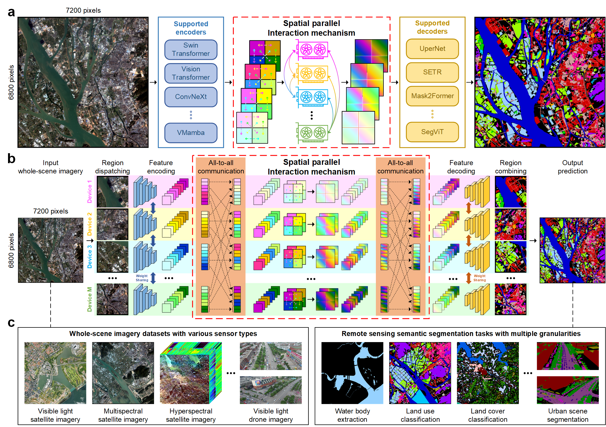

# REST: Holistic Learning for End-to-End Semantic Segmentation of Whole-Scene Remote Sensing Imagery (IEEE TPAMI 2025)

[](https://ieeexplore.ieee.org/document/11163637)
[](https://www.python.org/downloads/release/python-390/)
[](https://pytorch.org/)
[](LICENSE)

Official implementation of the IEEE TPAMI 2025 paper "REST: Holistic Learning for End-to-End Semantic Segmentation of Whole-Scene Remote Sensing Imagery".

## 🏠 Method Overview

REST (Robust End-to-end semantic Segmentation architecture for whole-scene remoTe sensing imagery) is the **first intrinsically end-to-end framework** for truly holistic segmentation of whole-scene remote sensing imagery (WRI). Unlike conventional deep learning methods that struggle with GPU memory limitations and resort to suboptimal cropping or fusion strategies, REST enables seamless processing of large-scale remote sensing imagery without performance degradation.

<div align="center">

</div>

*Overview of the REST framework. The Spatial Parallel Interaction Mechanism (SPIM) enables holistic processing of whole-scene remote sensing imagery through efficient parallel computation and divide-and-conquer strategy, eliminating the need for cropping or fusion while maintaining global context awareness.*

## 🎯 Key Features

-  **First end-to-end framework** for holistic whole-scene remote sensing imagery segmentation
-  **Spatial Parallel Interaction Mechanism (SPIM)** - Novel approach combining parallel computation with divide-and-conquer strategy to overcome GPU memory constraints while achieving global context awareness
-  **Plug-and-play architecture** - Compatible with mainstream segmentation encoders/decoders and foundation models, enabling seamless integration
-  **True holistic processing** - Eliminates suboptimal cropping or fusion strategies, processing entire scenes without performance degradation
-  **Memory efficient** - Processes arbitrarily large images through innovative parallel interaction mechanisms
-  **Scalable performance** - Near-linear throughput scaling with additional GPUs (theoretical and experimentally validated)
-  **Multi-platform support** - Satellite, drone, multispectral, and hyperspectral imagery in unified framework
-  **Versatile applications** - Single-class to multi-class segmentation scenarios with consistent superior performance

## 📝 Updates & Milestones

- **[2024.10.08]** 🎯 REST repository created and project initiated!
- **[2025.01.25]** 🖥️ Web interface and online inference system deployed
- **[2025.03.31]** 🏋️‍♂️ Released initial pre-trained model weights for testing (GLH-Water & Five-Billion-Pixels)
- **[2025.04.02]** 📦 Updated sample datasets and testing data for quick start
- **[2025.09.10]** 🎉 **REST paper officially accepted by IEEE TPAMI 2025!**
- **[2025.09.19]** 📚 **[Current]** Major documentation update - comprehensive guides for training, evaluation, and data preparation
- **[Coming Soon]** 🚀 Complete model zoo release with all benchmark results
- **[Coming Soon]** 🌟 Integration with Hugging Face Model Hub for easy access
- **[In Development]** 🔧 Multi-task support beyond segmentation (detection, classification, change detection)
- **[In Development]** ⚡ REST v2 - Enhanced training and inference efficiency with optimized algorithms

## 🚀 Quick Start **[in preparation]**

### Installation

Please refer to [INSTALL.md](docs/INSTALL.md) for detailed installation instructions.

### Data Preparation

1. Download the datasets:
   - [GLH-Water Dataset](https://jack-bo1220.github.io/project/GLH-water.html)
   - [Five-Billion-Pixels Dataset](https://x-ytong.github.io/project/Five-Billion-Pixels.html)
   - [WHU-OHS Dataset](https://irsip.whu.edu.cn/resv2/WHU_OHS_show.php)
   - [UAVid Dataset](https://uavid.nl/)

2. Download pre-trained models:
   ```bash
   # Download all models
   cd rest/checkpoints
   python download_model.py
   
   # Or download individually
   wget https://github.com/weichenrs/REST_code/releases/download/models/REST_water_swin_large.pth -O checkpoints/REST_water_swin_large.pth
   wget https://github.com/weichenrs/REST_code/releases/download/models-0.1/baseline_fbp_swin_large.pth -O checkpoints/baseline_fbp_swin_large.pth
   ```

3. Organize your data structure:
   ```
   REST/
   ├── data/
   │   ├── GLH-Water/
   │   ├── FBP_new/
   │   ├── WHU-OHS/
   │   └── UAVid/
   ├── checkpoints/
   │   ├── REST_water_swin_large.pth
   │   └── baseline_fbp_swin_large.pth
   └── ...
   ```

### Inference

Run inference on sample images:
```bash
# Test on GLH-Water dataset
bash test.sh configs/rest/rest_water_swin_large.py checkpoints/REST_water_swin_large.pth

# Test on Five-Billion-Pixels dataset
bash test.sh configs/baseline/baseline_fbp_swin_large.py checkpoints/baseline_fbp_swin_large.pth
```

### Training

Train your own REST model:
```bash
# Single GPU training
python tools/train.py configs/rest/rest_water_swin_large.py

# Multi-GPU training
bash tools/dist_train.sh configs/rest/rest_water_swin_large.py 4
```

## 📁 Model Zoo **[in preparation]**

We provide pre-trained models for different datasets and configurations:

| Model | Dataset | Backbone | mIoU | Config | Download |
|-------|---------|----------|------|--------|----------|
| Baseline | GLH-Water | Swin-Large | TODO | TODO | TODO |
| Baseline | Five-Billion-Pixels | Swin-Large | 69.68 | [config](configs\swin\fbp\swin-large-patch4-window7-skysense-pre_upernet_2xb2-80k_fbp-512x512.py) | [model](https://github.com/weichenrs/REST_code/releases/download/models-0.1/baseline_fbp_swin_large.pth) |
| Baseline | WHU-OHS | Swin-Large | TODO | TODO | TODO |
| Baseline | UAVid | Swin-Large | TODO | TODO | TODO |
| REST | GLH-Water | Swin-Large | TODO | TODO | [model](https://github.com/weichenrs/REST_code/releases/download/models/REST_water_swin_large.pth) |
| REST | Five-Billion-Pixels | Swin-Large | 72.95 | TODO | TODO |
| REST | WHU-OHS | Swin-Large | TODO | TODO | TODO |
| REST | UAVid | Swin-Large | TODO | TODO | TODO |


## 📖 Documentation **[in preparation]**

- [Installation Guide](INSTALL.md): Detailed installation instructions
- [Data Preparation](docs/DATA_PREPARATION.md): How to prepare your datasets
- [Training Guide](docs/TRAINING.md): Comprehensive training instructions
- [Evaluation Guide](docs/EVALUATION.md): Model evaluation and metrics


## 🛠️ Project Structure

```
REST/
├── assets/                 # Images and visual resources
├── checkpoints/           # Pre-trained model weights
├── configs/               # Configuration files
│   ├── _base_/           # Base configurations
│   ├── compare/          # Comparison model configs
│   ├── convnext/         # ConvNeXt backbone configs
│   ├── swin/             # Swin Transformer backbone configs
│   └── vssm/             # Vision State Space Model configs
├── data/                 # Dataset directory
├── docs/                 # Documentation files
├── mmcv_custom/          # Custom MMCV components
├── mmseg/                # Core segmentation modules
├── sh/                   # Shell scripts for execution
├── tools/                # Training and testing utilities
└── vmamba/               # VMamba backbone integration
```

## 🤝 Contributing

We welcome contributions! Please see [CONTRIBUTING.md](CONTRIBUTING.md) for guidelines.

## 📄 Citation

If you find REST useful in your research, please consider citing:

```bibtex
@article{rest2025,
  title={REST: Holistic Learning for End-to-End Semantic Segmentation of Whole-Scene Remote Sensing Imagery},
  author={Chen, Wei and Bruzzone, Lorenzo and Dang, Bo and Gao, Yuan and Deng, Youming and Yu, Jin-Gang and Yuan, Liangqi and Li, Yansheng},
  journal={IEEE Transactions on Pattern Analysis and Machine Intelligence},
  year={2025},
  volume={},
  number={},
  pages={1-18},
  publisher={IEEE},
  doi={10.1109/TPAMI.2025.3609767}}
}
```

## 📞 Contact

- **Core Author**: [Wei Chen](mailto:weichenrs@whu.edu.cn),
- **Corresponding Author**: [Yansheng Li](mailto:yansheng.li@whu.edu.cn),
- **Institution**: [Wuhan University](https://www.whu.edu.cn/), [School of Remote Sensing and Information Engineering](https://rsgis.whu.edu.cn/)
- **Project Page**: [https://weichenrs.github.io/REST/](https://weichenrs.github.io/REST/)

## 🙏 Acknowledgements

This work is built upon several excellent open-source projects:
- [MMSegmentation](https://github.com/open-mmlab/mmsegmentation) - Comprehensive segmentation toolbox
- [SkySense](https://github.com/Jack-bo1220/SkySense) - Powerful remote sensing foundation model SkySense
- [VMamba](https://github.com/MzeroMiko/VMamba) - VMamba implementation

We thank the remote sensing community for providing high-quality datasets and the authors of foundation models for enabling our plug-and-play architecture design.

## 📜 License

This project is licensed under the MIT License - see the [LICENSE](LICENSE) file for details. 

**⚠️ Important**: The source code is only available for **non-commercial research**. For commercial use, please contact Yansheng Li at Wuhan University (yansheng.li@whu.edu.cn).

---

<div align="center">
⭐ If you find this project helpful, please consider giving it a star! ⭐
</div>
